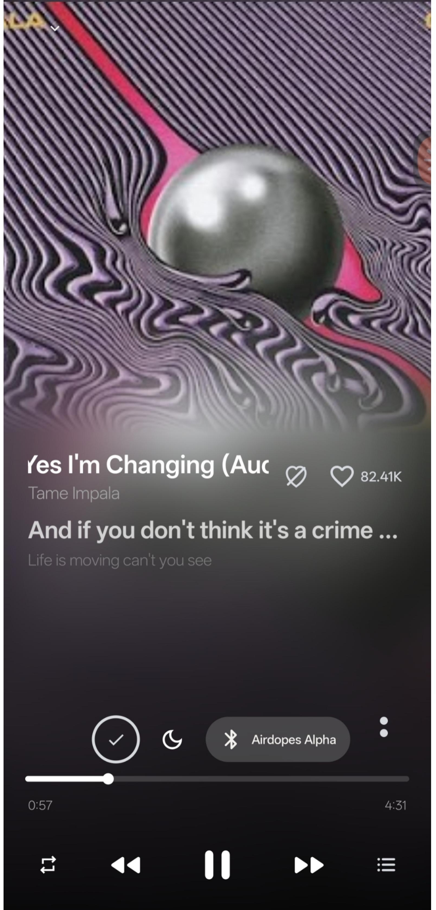
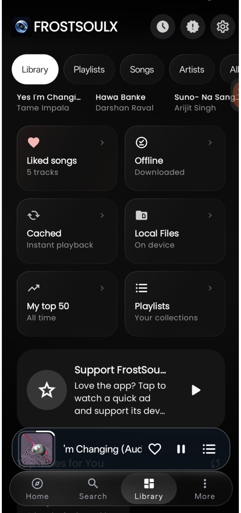
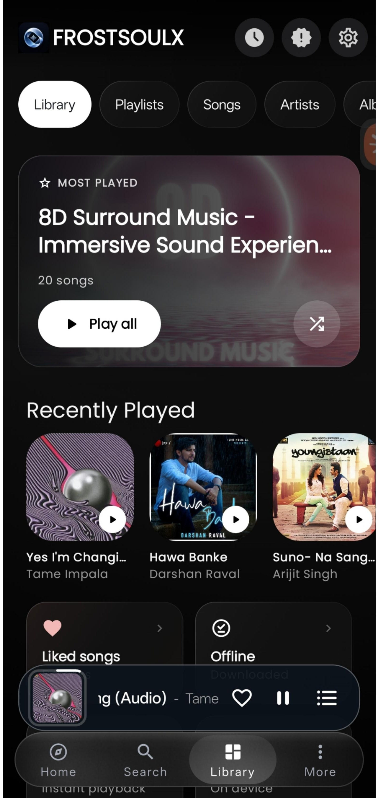
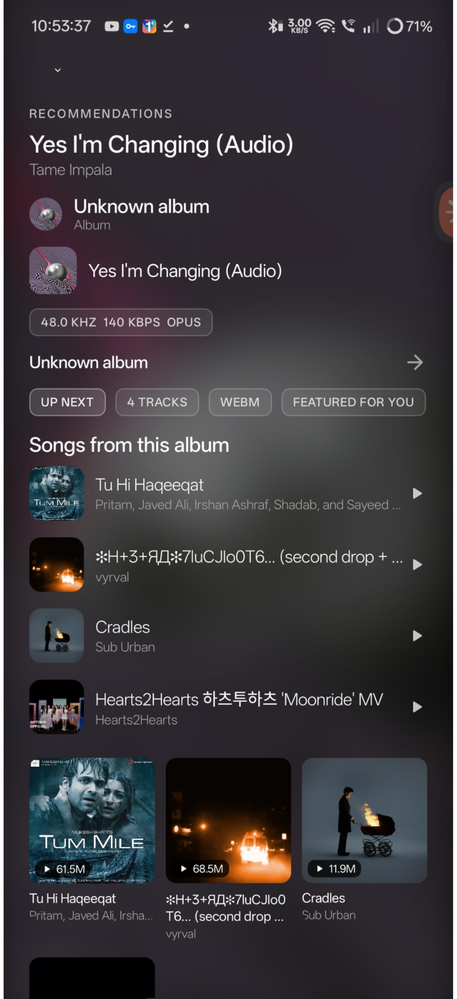
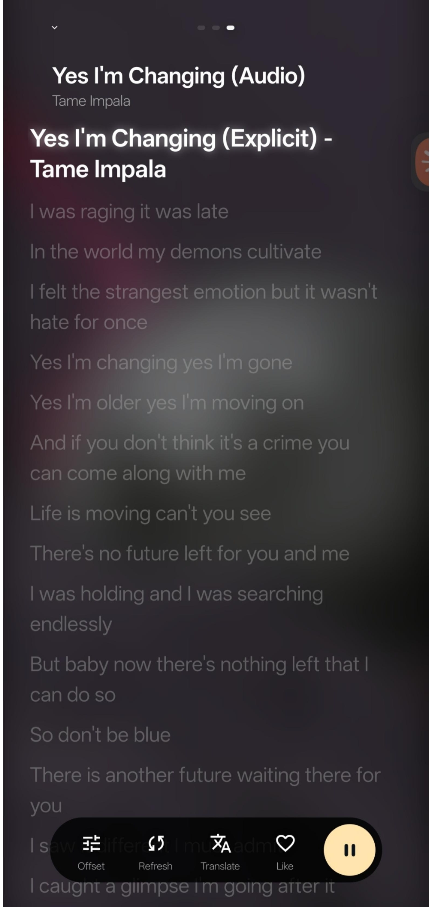

# FrostSoulX

[](https://sakuradev31.github.io/frostsoulx/)
[](https://kotlinlang.org/)
[](https://developer.android.com/compose)
[](https://developer.android.com/media/media3)
[](LICENSE)

**FrostSoulX is an artwork-driven Android music player for listeners who want a calm, focused, and highly personal listening experience.** It brings local music, YouTube Music discovery, synchronized lyrics, immersive player views, recommendations, and a carefully refined Home, Search, and Library experience into one cohesive app.

[Open the FrostSoulX website](https://sakuradev31.github.io/frostsoulx/) · [Download V14.0.6](https://github.com/sakuraDev31/frostsoulx/releases/tag/v14.0.6) · [View the source](https://github.com/sakuraDev31/frostsoulx)

> FrostSoulX is an independent project. It is not an official Google, YouTube, or YouTube Music application. It does not reproduce proprietary application source code or proprietary application assets.

## Screenshots

The current visual direction uses a near-black canvas, artwork-led atmosphere, restrained glass surfaces, compact playback controls, and a persistent mini-player above the navigation bar. Each screen is shown at full width so the complete phone layout remains readable.

### Immersive player



### Library overview



### Most Played library



### Recommendations



### Lyrics



## Features

### Playback and library

- Android Media3 background playback and media controls.
- Queue management, seeking, repeat, playback speed, downloads, and sleep timer.
- Local files, downloaded music, cached playback, playlists, artists, albums, and liked songs.
- Artwork metadata for notifications, system media controls, and the mini-player.

### FrostSoulX player experience

- Vinyl-inspired and immersive artwork-driven player presentations.
- Seamless artwork atmosphere for player, recommendation, and lyric contexts.
- Compact mini-player docked above the bottom navigation with quick playback actions.
- Album, artist, playlist, and recommendation screens designed around readable hierarchy and artwork prominence.

### Lyrics and discovery

- Synchronized lyrics with timing offset, refresh, translation, and artist navigation.
- Home discovery, contextual recommendations, search, album pages, artist profiles, and playlists.
- Listening history and context-aware sections such as Featured for You, Continue Listening, and For This Moment.
- Artwork palette extraction for player backgrounds and ambient visual treatment.

### Audio

- Media3 audio processing with a low-latency immersive path.
- Steam Audio integration is available as an experimental feature and may produce distorted or clipped sound on some devices.
- The immersive audio OFF state preserves the original playback path and bypasses the experimental processor.
- The experimental path uses a 384-frame processing quantum and exposes development diagnostics for tuning.

## Build from source

Requirements: Android Studio, Android SDK, JDK 21, and the included Gradle Wrapper.

```bash
git clone --branch genspark_ai_developer https://github.com/sakuraDev31/frostsoulx.git
cd frostsoulx
./gradlew assembleGmsMobileArm64Debug --no-daemon --build-cache
```

Generated APKs are placed under `app/build/outputs/apk/`. The repository also contains bounded GitHub Actions workflows for ARM64 release builds and x86_64 emulator testing.

## Download and CI

The active development branch is [`genspark_ai_developer`](https://github.com/sakuraDev31/frostsoulx/tree/genspark_ai_developer). See the [GitHub Actions workflows](https://github.com/sakuraDev31/frostsoulx/actions) for build status, artifacts, and release runs.

Signed release builds require the repository’s configured release secrets. Do not commit API keys, signing passwords, keystores, or `local.properties` files.

## Credits

FrostSoulX acknowledges the open-source projects and contributors whose work provides foundation, references, or inspiration:

- **[ArchiveTune](https://github.com/rukamori/ArchiveTune)** for the upstream Android music-player foundation and applicable source notices.
- **[InnerTube](https://github.com/tombulled/innertube)** for YouTube and YouTube Music data-model and client integration reference.
- **[Metrolist](https://github.com/mostafaalagamy/Metrolist)** for open-source Android music-player architecture and implementation inspiration.
- **[Steam Audio](https://github.com/ValveSoftware/steam-audio)** for the experimental spatial-audio foundation.

FrostSoulX is independently maintained. The names, licenses, notices, trademarks, and original contributions of credited projects remain their respective owners’ property.

## License

FrostSoulX is distributed under the [GNU General Public License v3.0](LICENSE). Review the license and source notices before redistributing modified builds.

FrostSoulX is not affiliated with Google, YouTube, YouTube Music, or any other service referenced by the application. Users are responsible for complying with the terms and laws applicable to the services they access.

## Links

- [FrostSoulX website](https://sakuradev31.github.io/frostsoulx/)
- [Source code](https://github.com/sakuraDev31/frostsoulx/tree/genspark_ai_developer)
- [V14.0.6 release](https://github.com/sakuraDev31/frostsoulx/releases/tag/v14.0.6)
- [Issues](https://github.com/sakuraDev31/frostsoulx/issues)
- [Pull requests](https://github.com/sakuraDev31/frostsoulx/pulls)
- [Contributing guide](CONTRIBUTING.md)
- [License](LICENSE)
